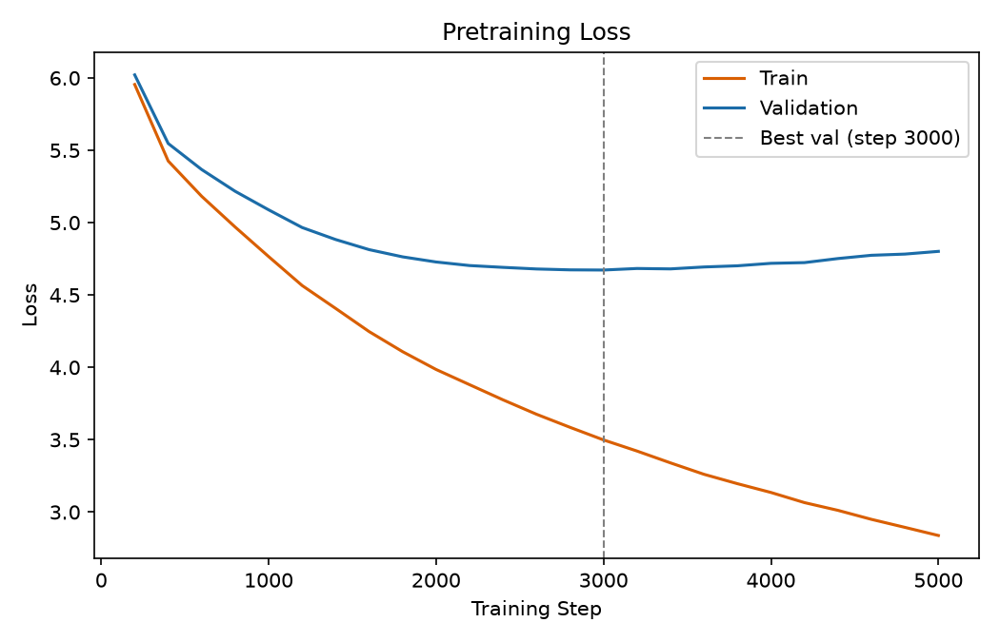

# Tiny GPT, from scratch

A GPT-style transformer language model and BPE tokenizer, implemented from scratch in PyTorch and trained on a corpus of arXiv abstracts. Includes a from-scratch BPE tokenizer with a custom trainer, a decoder-only transformer, and a small supervised fine-tuning (SFT) pipeline.

## Corpus & tokenizer

**Corpus**: 8,000 abstracts pulled from arXiv via the `arxiv` package (`cs.LG`), whitespace-normalized. ~11.5M characters total.

**Tokenizer**: byte-level BPE, trained from scratch. Vocab size 5,000 (293 base byte/character tokens + 4,707 learned merges), giving ~4.85 characters per token on this corpus.

## Model

Decoder-only transformer, closely following Karpathy's "Let's build GPT," scaled for a BPE vocabulary instead of char-level:

| | |
|---|---|
| Layers | 6 |
| `d_model` | 384 |
| Attention heads | 6 (`d_head=64`) |
| Context length | 384 tokens |
| Positional encoding | sinusoidal |
| Vocab size | 5,000 |
| **Total parameters** | **14.49M** |

## Pretraining



Trained on an 80/20 train/val split of the tokenized corpus, `AdamW`, gradient clipping (`max_norm=1.0`).

**Overfitting**: as shown above, validation loss bottoms out at **step 3000 (val loss 4.67)** while training loss keeps decreasing well past that point. The model has more capacity than the corpus can fill without memorizing. Used early stopping: the step-3000 checkpoint is the one used for everything below, not the final training step.

### Sample generation (pretrained, no fine-tuning)

> On-policy distillation (OPD) has emerged as a promising paradigm for improving the collection of models of model decisions. Recent studies have become a universal property of represented teacher supervision into the students in agentic capabilities of multi-agent reinforcement learning without needing at improving aggregate performance over time, calls. This research proposes a strategic transfer in agentic reinforcement learning. Aslay integrates each user, conditioned on context measures to construct terminal rollouts through trajectory-induced rollout groups. Specifically, Actor-OPD, a reinforcement learning framework, and a post-view reward head that trains the students between AP and performance gains of supervision while preserving the average forgetting demonstration. Experiments on OPD and OPD and reinforcement learning benchmarks show that OPD, the gains exceed the full teacher methods on both POPD and out-of-distribution held-out tasks.

Characteristic of a small, moderately-trained base LM: strong local fluency and correct domain vocabulary (reinforcement learning, distillation, rollouts, reward models), but no long-range coherence. It also invents fake terms that sound plausible, such as 'Aslay'.

Below is a generation where the the output jumps into the start of a separate abstract. To try to stop this, a small SFT pipeline was developed.

> This work presents a general framework for training [...] evaluated across datasets, and all game binding. The results demonstrate that the largest gain comes from real and real data, and transcript-based approach achieves an area under the risk-averse demand model (AUROC).
>
> Large language models (LLMs) have demonstrated strong performance across diverse domains (e.g., token generation, but their performance degraded in long-horizon domains remains unexplored. Existing federated learning methods are typically treated as a proxy for downstream task-based inference-time scalable [...]

## Supervised fine-tuning

**Task**: given the first 15-30% of a real abstract (randomized cut point, by word count) as a prompt, generate a coherent continuation of *that specific abstract*, directly targeting the cross-document blurring seen above. Examples are drawn from the same corpus (no new data collection), formatted as:

```
<|prompt|>{first 15-30% of an abstract}<|response|>{the rest of that abstract}
```

`<|prompt|>`/`<|response|>` are plain strings built from existing vocabulary. Loss is masked (`ignore_index=-100`) over the prompt portion, so gradient signal only comes from predicting the response.

Fine-tuned from the step-3000 pretrained checkpoint.

### Data volume ablation

The first SFT run used 300 examples (~240 after an 80/20 split and filtering out abstracts too long for the model's context window). It overfit within a single epoch, and generation samples showed no clear improvement in topical coherence over the base model. Scaling to 2,000 examples changed that:

**Same prompt, three checkpoints** (`"We propose a novel method for improving sample efficiency in"`):

| Checkpoint | Output |
|---|---|
| Pretrained | `...0,0,0,55 candidates via series formation-to-marginal correctness in counterfactual evaluations... a multi-objective evaluation framework... dimensionality reduction approaches... sampling-cost estimator... deep ambiguous instance-dependent benchmarks and the high-reward regions... semantic relevance...` |
| SFT (300 ex.) | `...inference on one designed to represent an artificial intelligence (AI) method. Building on generalizing these insights, we propose an enpropenalized treatment estimator for hierarchical queried treatment planning... generative methods... CIFAR... face images...` |
| SFT (2,000 ex.) | `...through a simple neural networks. We study of Pub models... a novel linear representation... In particular, we study we consider a class of polynomial setting of BQ algorithms... We further prove that there is robust to an optimal algorithm for $k$-sample complexity of $O(1/\delta)$...` |

Both the base model and the 300-example run drift across multiple unrelated subfields (causal inference, computer vision, semantic relevance) within one continuation. The 2,000-example run stays inside one coherent theme for the entire generation: neural network sample complexity. This included circling back to "sample complexity" as a direct echo of the prompt's "sample efficiency." Same pattern holds on a second prompt (`"This work presents a general framework for training"`): the 2,000-example checkpoint stays on optimization/convergence theory throughout, where the base model's response (shown above) breaks into an unrelated second abstract partway through.

## Repo layout

```
src/llm/
  tokenizer.py   BPE tokenizer: train/encode/decode/save/load
  model.py       transformer (attention, blocks, LanguageModel)
  train.py       data loading, pretraining loop, SFT loop, checkpointing
corpus.txt       raw training corpus (abstracts, "\n\n"-separated)
vocab.json       trained tokenizer vocab + merges
loss_history.json   pretraining (step, train_loss, val_loss) history
results.ipynb    checkpoint loading + generation comparisons
```

Checkpoint files (`*.pt`) aren't committed — large binaries, regenerable from the training code and corpus.
